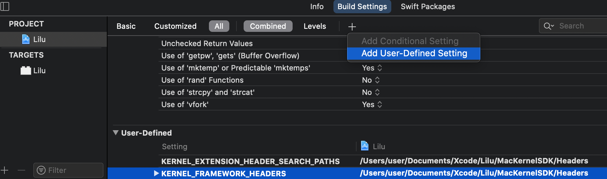
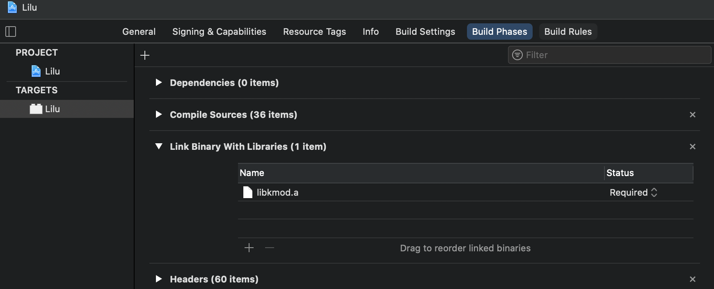

MacKernelSDK
============

This project lets your kernel extensions (kexts) target a broad range of XNU kernels when using the latest Xcode version right from the interface. In addition, it also includes several headers only available in other projects or older Xcode releases.

## Quick start

To start using **MacKernelSDK** do the following steps:

1. Clone MacKernelSDK to your project directory:

    ```sh
    git clone https://github.com/acidanthera/MacKernelSDK
    ```

2. Add custom `KERNEL_EXTENSION_HEADER_SEARCH_PATHS` and `KERNEL_FRAMEWORK_HEADERS` values in project configuration in Xcode. To do this choose **Add User-defined Setting**.

    ```
    KERNEL_EXTENSION_HEADER_SEARCH_PATHS = $(PROJECT_DIR)/MacKernelSDK/Headers
    KERNEL_FRAMEWORK_HEADERS = $(PROJECT_DIR)/MacKernelSDK/Headers
    ```

    

3. Link to custom `libkmod.a` library by adding it to your kernel extension **Link Binary with Libraries**.

    

4. Ensure that **Library Search Paths** contains the `libkmod.a` location, e.g.:

    ```
    $(PROJECT_DIR)/MacKernelSDK/Library/x86_64
    ```

    Otherwise Xcode will link to the original libkmod.

5. Optionally add `/MacKernelSDK` to `.gitignore`.

6. To make sure that you use the right SDK check for `__ACIDANTHERA_MAC_SDK` macro in `Availability.h`.

## Targeting `i386`

To compile for 32-bit you will need to add a set of flags in your project:

1. Other C Flags (`OTHER_CFLAGS`):

    - `-static`
    - `-nostdlib`
    - `-Wno-stdlibcxx-not-found`
    - `-target i386-apple-macos10.6`
    - `-fallow-unsupported`
    - `-fno-stack-protector` if targeting 10.5 and older
    - `-fno-jump-tables` if targeting 10.5 and older

2. Other Linker Flags (`OTHER_LDFLAGS`):

    - `-static`
    - `-target i386-apple-macos10.6`

3. C++ Standard Library (`CLANG_CXX_LIBRARY`) to **Compiler Default** or empty.

4. Library Search Paths set to contain a kmod with an i386 slice, e.g. $(PROJECT_DIR)/MacKernelSDK/Library/universal.

5. The symbol table may be misaligned due to i386 kexts being of type `MH_OBJECT`.  
`fix-macho32` is provided in the `scripts` directory of [ocbuild](https://github.com/acidanthera/ocbuild) to correct alignments. Python 3 and `macholib` are required.

    Usage:
    ```
    ./fix-macho32 [bin_path]
    ```

## Extensions and modifications

- Based on macOS 11 SDK from Xcode 12.0 (12A7209)
- Added extra headers from `xnu-8019.80.24`:
    - Absolute time macros (`libkern/OSBase.h`)
    - Cryptography (`corecrypto`, `libkern/crypto`)
    - CPU PM (`i386/cpu_topology.h` and `i386/pmCPU.h`)
    - MAC Framework (`security/_label.h`, `security/mac_framework.h`, `security/mac_policy.h`)
    - Skywalk Subsystem (`skywalk`, `IOKit/skywalk/IOSkywalkSupport.h`)
- Added private headers from IOHIDFamily 1446.140.2:
    - `IOHIDPrivateKeys.h`
    - `IOHIDEventServiceKeys_Private.h`
    - `IOHIDEvent.h`
    - `IOHIDEventFieldDefs.h`
    - `IOHIDEventService.h`
    - `IOHIDEventTypes.h`
    - `IOHIDUtility.h`
- Added private headers from IOHIDFamily 1035.70.7:
    - `AppleHIDUsageTables.h` (removed in newer releases)
- Added private headers for IOBluetoothFamily from 10.6 SDK
    - `IOBluetoothInternal.h` (removed in newer releases)
- Added private `IOPCIHostBridge` class from IOPCIFamily 484.40.6
- Added extra compiled and reverse-engineered headers:
    - SMBus (`IOKit/IOSMBusController.h`)
    - Apple Smart Battery (`IOKit/battery/AppleSmartBatteryCommands.h`)
    - KDP (`kdp/kdp_support.h`)
    - NKE private APIs (`IOKit/network`)
    - IOUSBFamily from macOS 10.10 SDK
    - IO80211Family from Black80211 originally created by Roman Peshkov
    - IOSkywalkFamily by cjiang (`IOKit/skywalk`)
    - IOBluetoothFamily by cjiang (`IOKit/bluetooth`) for macOS 11 and below
- Added kmod targeting earlier macOS kernels:
    - 10.6 64-bit or newer (`Library/x86_64/libkmod.a`)
    - 10.4 or newer (`Library/universal/libkmod.a`)
- Added availability checking when targeting older macOS versions:
    - In `string.h` to avoid using new checked interfaces before 10.13
    - In `IOService.h` to avoid report virtual methods before 10.9
    - In `RootDomain.h` to avoid report virtual methods before 10.9
    - In `OSMetaClass.h` to avoid DriverKit usage before 10.15
    - In `cdefs.h` to avoid Darwin14 aliases before 10.10
    - In `assert.h` to avoid kext assertion checking before 10.12
    - In `IOHIDDevice.h` to avoid new virtual methods before 10.14
    - In `IOFramebuffer.h` to avoid new virtual methods before 10.13
    - In `IONDRVFramebuffer.h` to avoid new virtual methods before 10.13
    - In `IOSCSIParallelInterfaceController.h` to avoid new virtual methods before 10.7
    - In `IOPCIBridge.h` to avoid new virtual methods before 12.0
    - In `IOService.h` to avoid init methods before 10.10
    - In `IOUserClient.h` to avoid new virtual methods before 10.6
    - In `IOBlockStorageDevice.h` to avoid new virtual methods before 10.12
    - In `ipc_mig.h` to avoid new methods before 10.6
- Fixed compiler warnings:
    - In `IOPCIDevice.h` due to missing overrides
    - In `OSMetaClass.h` due to using unsupported memory checking with older clang
    - In `kauth.h` due to KPI deprecation
    - In `net`, `netinit`, `network`, `sys` due to NKE KPI deprecation
    - In `hid`, `serial`, `usb` due to missing overrides and KPI deprecation in favor of `DriverKit`
    - In `OSUnserialize.h` due to `OSStringPtr` misuse
    - In `KUNCUserNotifications.h` due to KPI deprecation
    - In `IOSCSIParallelInterfaceController.h` due to missing overrides
    - In `IOPCIBridge.h` due to missing overrides
